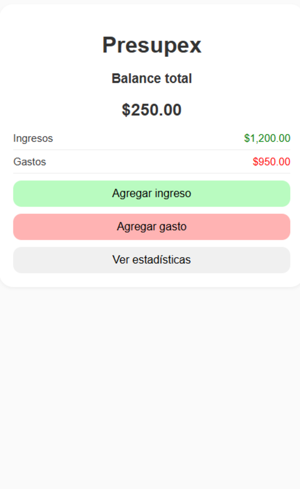
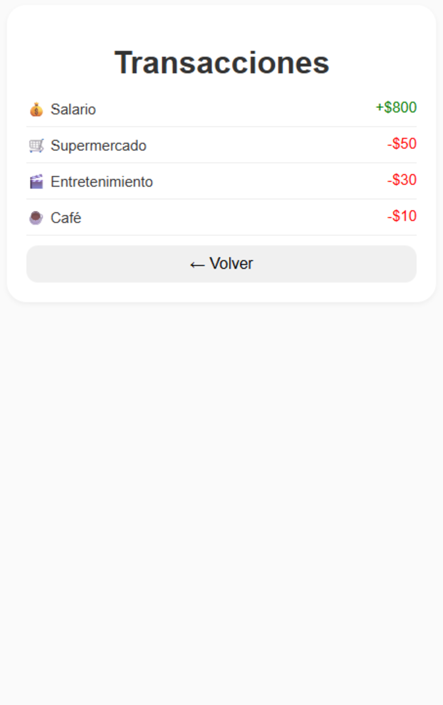
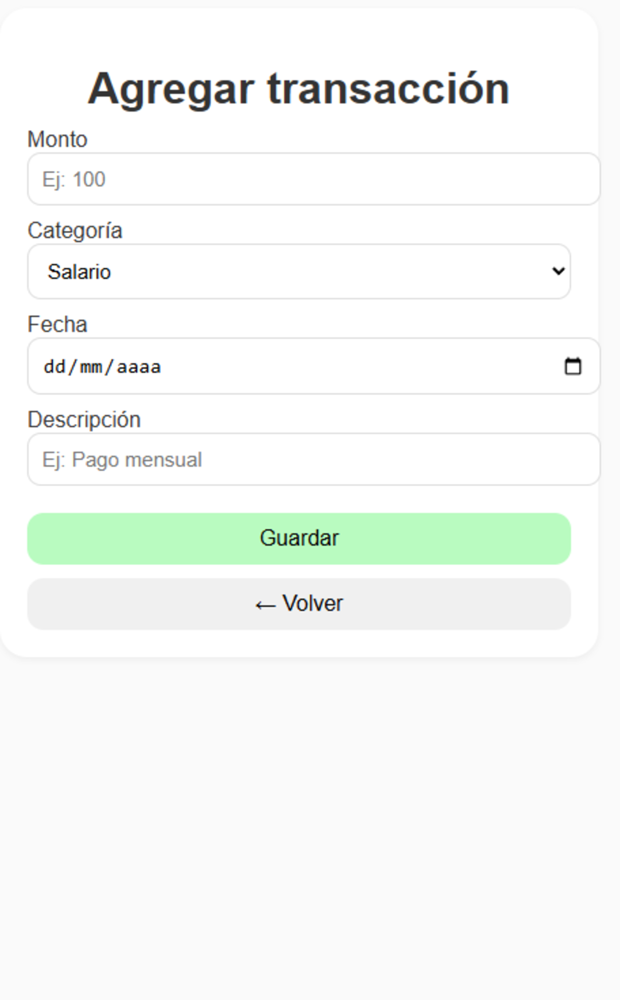

# Proyecto-INTEGRADOR-II
# 💰 Prepupex

### Descripción general
Prepupex es una aplicación para llevar el control de gastos e ingresos personales.  
La idea es que el usuario pueda ver cuánto dinero entra y sale, además de tener un balance claro y gráficos que le ayuden a entender sus finanzas.

El proyecto se está desarrollando en **Android Studio con Kotlin**, y se usarán herramientas como **Room Database**, **RecyclerView**, y **MPAndroidChart** para los gráficos.

---

## 🧩 Funciones principales
- Agregar ingresos y gastos con su respectiva categoría, monto y fecha.  
- Mostrar el balance general de forma sencilla.  
- Ver el historial completo de movimientos.  
- Mostrar estadísticas con gráficos de barras y pastel.  
- Interfaz limpia y minimalista (Material Design).

## 📱 Mockups de la aplicación

### Pantalla 1 - Dashboard (Inicio)
Vista principal con el balance total, botones para agregar ingreso o gasto.

### Pantalla 2 - Lista de Transacciones
Lista de movimientos recientes, con íconos, montos y fechas.

### Pantalla 3 - Agregar Transacción
Formulario para registrar un ingreso o gasto con monto, descripción, categoría y fecha.

### Pantalla 4 - Estadísticas
Pantalla con gráficos de barras y pastel que resumen los ingresos y gastos.

---

## 🧠 Tecnologías que voy a usar
- Kotlin  
- Android Studio  
- Room Database  
- RecyclerView  
- MPAndroidChart  
- ViewModel y LiveData  

## 📅 Estado actual
Actualmente estoy en la fase de **diseño de mockups**, y luego continuaré con la implementación del modelo de datos y la lógica de la app.
